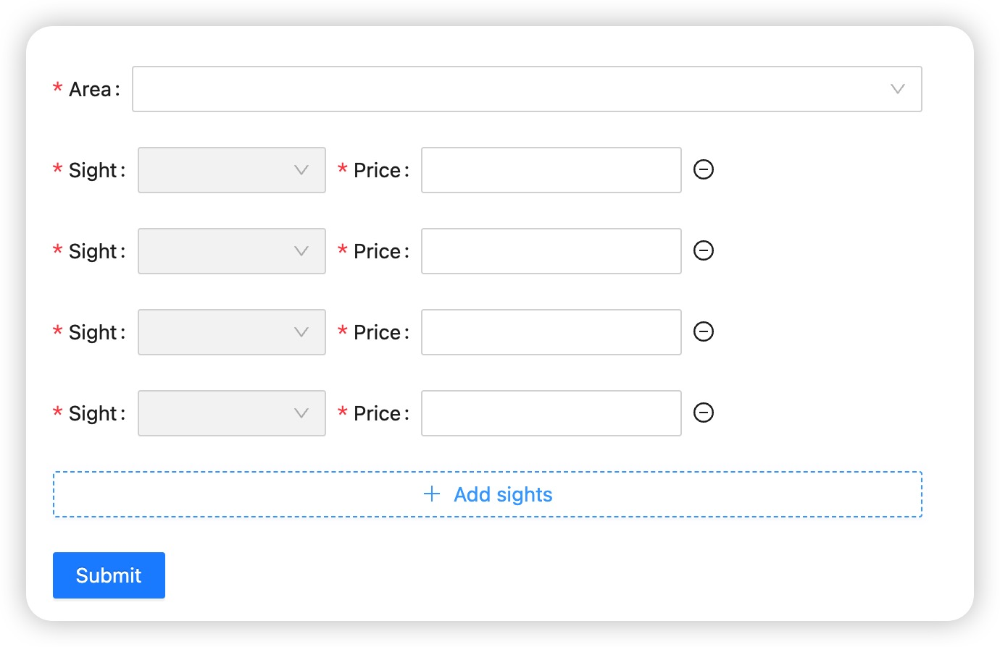

# MutationObserver

前段时间碰到一个需求，一个可以动态增加一行的列表，如下图 1 所示。


这里用到了 ant design 的 Form.List 组件进行开发，但是遇到一个问题：当 Form.List 的高度固定时，点击新增按钮时，新增的一行会在超出高度之外，所以从用户体验的角度考虑，希望可以在新增之后自动滚动到 Form.List 的底部。

首先想到的方案是，给 Form.List 绑定 ref，然后在点击新增按钮时，获取 Form.List 的高度，并调用 `scrollTo` 方法将滚动条位置跳转到 Form.List 的高度。

```tsx
export default function List() {
  const listRef = useRef();

  return (
    <Form.List>
      {(fields, { add, remove }, { errors }) => (
        <>
          <div ref={listRef}>
            {fields.map((field, index) => (
              <Form.Item label="input">
                <Input />
              </Form.Item>
            ))}
          </div>
          <Form.Item>
            <Button
              type="dashed"
              onClick={() => {
                add();
                if (listRef.current) {
                  const height = listRef.current.scrollHeight;
                  listRef.current.scrollTo(0, height);
                }
              }}
            >
              Add field
            </Button>
          </Form.Item>
        </>
      )}
    </Form.List>
  );
}
```

但是实际执行的过程中，发现`scrollHeight`会有延迟，也就是说点击新增按钮时，`scrollHeight`的值还是点击前的，所以执行`scrollTo`方法后，实际滚动的位置始终会在倒数第二个`Input`的位置。

这时，想到使用`setTimeout`，不过一方面`setTimeout`并不稳定，另一方面这种写法实在不够优雅。

```tsx
<Button
  type="dashed"
  onClick={() => {
    add();
    if (listRef.current) {
      setTimeout(() => {
        listRef.current.scrollTo(0, listRef.current.scrollHeight);
      }, 0);
    }
  }}
>
  Add sights
</Button>
```

后来 Google 搜索解决方案看到有人提到一个 API：[`MutationObserver`](https://developer.mozilla.org/zh-CN/docs/Web/API/MutationObserver)。

> MutationObserver 接口提供了监视对 DOM 树所做更改的能力。它被设计为旧的 Mutation Events 功能的替代品，该功能是 DOM3 Events 规范的一部分。

那如果我对 Form.List 添加一个`MutationObserver`监听，当 Form.List 的 scrollHeight 发生变化之后再执行 scrollTo 方法，是不是就没有延迟了呢？

```tsx
export default function List() {
  const listRef = useRef();
  const observerRef = useRef();

  function observerCallback(mutationsList, observer) {
    for (let index = 0; index < mutationsList.length; index++) {
      const mutation = mutationsList[index];
      if (mutation.type === 'childList') {
        listRef.current.scrollTo({
          left: 0,
          top: listRef.current.scrollHeight,
          behavior: 'smooth',
        });
      }
    }

    observer.disconnect();
  }

  function scrollToBottom() {
    if (observerRef.current) {
      observerRef.current.observe(listRef.current, config);
    }
  }

  useEffect(() => {
    if (listRef.current) {
      const config = { attributes: true, childList: true, subtree: true };
      const observer = new MutationObserver(observerCallback);
      observerRef.current = observer;
    }
  }, [listRef.current]);

  return (
    <Form.List>
      {(fields, { add, remove }, { errors }) => (
        <>
          <div ref={listRef}>
            {fields.map((field, index) => (
              <Form.Item label="input">
                <Input />
              </Form.Item>
            ))}
          </div>
          <Form.Item>
            <Button
              type="dashed"
              onClick={() => {
                add();
                scrollToBottom();
              }}
            >
              Add field
            </Button>
          </Form.Item>
        </>
      )}
    </Form.List>
  );
}
```

在点击新增按钮后，我们为 Form.List 增加一个`MutationObserver`实例，用于监听 Form.List 的 childList 的变化，当 childList 发生变化时，调用 scrollTo 将 Form.List 滚动至最后。

同时我们可以看到，`MutationObserver`的配置项除了`childList`之外，还可以配置`attributes`和`subtree`，MDN 的解释是

- **subtree**
  > 当为 true 时，将会监听以 target 为根节点的整个子树。包括子树中所有节点的属性，而不仅仅是针对 target。默认值为 false。
- **childList**
  > 当为 true 时，监听 target 节点中发生的节点的新增与删除（同时，如果 subtree 为 true，会针对整个子树生效）。默认值为 false。
- **attributes**
  > 当为 true 时观察所有监听的节点属性值的变化。默认值为 true，当声明了 attributeFilter 或 attributeOldValue，默认值则为 false。

所以之后如果有监听 DOM 元素节点变化、属性变化的需求，都可以使用`MutationObserver`API 来优雅实现啦。

PC 端浏览器兼容性如下

| Chrome     | Edge     | Safari        | Firefox    | Opera         | IE         |
| ---------- | -------- | ------------- | ---------- | ------------- | ---------- |
| ~~4 - 17~~ |          | ~~3.1 - 5.1~~ |            |               |            |
| 18 - 26    |          | 6             | ~~2 - 13~~ | ~~10 - 12.1~~ |            |
| 27 - 104   | 12 - 104 | 6.1 - 15.5    | 14 - 103   | 15 - 89       | ~~6 - 10~~ |
| 105        | 105      | 15.6          | 104        | 90            | 11         |
| 106 - 108  |          | 16.0 - TP     | 105 - 106  |               |            |
