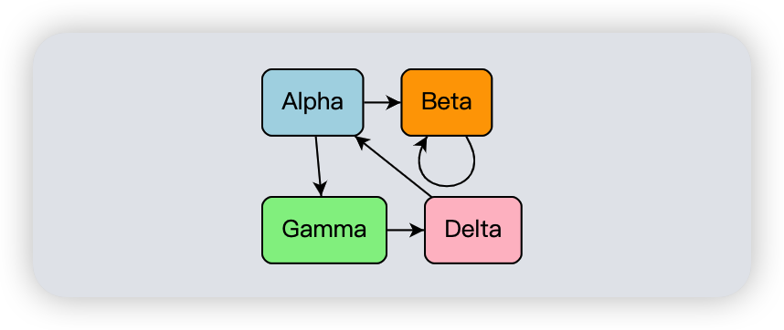
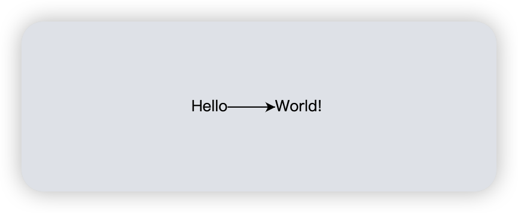

原文链接：https://gojs.net/latest/intro/

## GoJS 图表组件的介绍

**GoJS** 是一个可以让你在现代网络浏览器中轻松创建可交互图表的 JavaScript 库。**GoJS** 支持图形模板和图形对象属性到模型数据的数据绑定。**GoJS** 的模型由简单的 JavaScript 对象组成，其中会包含您的应用所需的任何属性，在开发中您只需要保存和恢复模型即可。**GoJS** 提供了许多预定义的工具和命令，这些工具和命令实现了大多数图表所需的标准行为，在绝大多数情况下可以通过设置属性的方式对图表的外观和行为进行定制。

## 一个简单的 GoJS 图

下面的代码定义了一个节点模板和模型数据，它生成了一个含有少量节点和链接的小图表。

```javascript
const diagram = new go.Diagram('diagram');

// 节点模板描述了每个节点应该如何被构建
diagram.nodeTemplate = new go.Node('Auto') // 该 Shape 会环绕在 TextBlock 四周
  .add(
    new go.Shape('RoundedRectangle')
      // Node.data.color 会绑定至 Shape.fill
      .bind('fill', 'color')
  )
  .add(
    new go.TextBlock({ margin: 8 }) // 指定 margin 以在文本周围增加一些空间
      // Node.data.key 会绑定至 TextBlock.text
      .bind('text', 'key')
  );

// 模型仅包含描述图表的基本信息
diagram.model = new go.GraphLinksModel(
  [
    // JavaScript 对象的 JavaScript 数组，每个节点一个
    // ”颜色”属性是专门为此应用程序添加的
    { key: 'Alpha', color: 'lightblue' },
    { key: 'Beta', color: 'orange' },
    { key: 'Gamma', color: 'lightgreen' },
    { key: 'Delta', color: 'pink' },
  ],
  [
    // JavaScript 对象的 JavaScript 数组，每个链接一个
    { from: 'Alpha', to: 'Beta' },
    { from: 'Alpha', to: 'Gamma' },
    { from: 'Beta', to: 'Beta' },
    { from: 'Gamma', to: 'Delta' },
    { from: 'Delta', to: 'Alpha' },
  ]
);

// 启用 Ctrl-Z 撤消和 Ctrl-Y 重做
diagram.undoManager.isEnabled = true;
```

上述代码将会创建以下图表：



你可以通过多种方式与图表进行交互：

- 你可以通过单击某个 Part 来选定一个元素（译者注：Part 包含 Adornment、Node 和 Link 三种类型的元素），被选定的 Node 的周围会出现高亮的蓝色矩形线条的 Adornment。 被选定的 Link 以及该 Link 的路径会用高亮的蓝色线条突出显示。
- 你可以一次选中多个 Parts，在单击时按住 Shift 键进行将该 Part 加入选择，按住 Control 键来切换该 Part 是否需要被选择。
- 另一种多选的方法是在背景上（而不是在某个 Part 上）按下鼠标，稍等片刻，然后拖动一个框。 当鼠标松开时框中的 Parts 将会被选中。 然后也可以使用 Shift 和 Control 键来继续选择或者切换该 Part 是否需要被选择。
- 使用 Control + A 选择图表中的所有 Parts。
- 通过选择并拖动来移动一个或多个节点。
- 使用复制/粘贴 (Control + C/Control + V) 或使用 Control + 鼠标拖动来复制选定的部分。
- 使用 Delete 键删除选定的 Parts。
- 如果滚动条可见，或者所有的 Parts 的集合小于图表的可视区域（"viewport"），你可以通过在背景上（而不是在某个 Part 上）按下鼠标并立即拖动来平移图表。
- 使用鼠标滚轮来实现上下滚动，使用 Shift + 鼠标滚轮来实现左右滚动，使用 Control + 鼠标滚轮来进行放大和缩小。

您还可以在触摸设备上用手指平移、缩放、选择、复制、移动、删除、撤消和重做。 大多数可以从键盘调用的命令都可以从默认的 Context Menu 中调用，您可以通过长按屏幕来获得该菜单。

文档中所有示例的独特之处在于它们都是“实时”的而不是屏幕截图！它们是由文档中显示的源代码实现的实际的图表。 您可以与这些图表进行交互——有些甚至可以显示动画。（译者注：受限于 kb 文档系统，这里都是屏幕截图而不是“实时”的，“实时”
示例请移步对应页面尝试）

如果您想查看更多有关 **GoJS** 功能的示例，请参阅 **GoJS** 示例目录。 为了更方便地搜索 JavaScript 代码和文档或通过修改示例进行实验，您可以通过多种方式安装 **GoJS** 工具包：

- 从 [Download](https://gojs.net/latest/download.html) 处下载 ZIP 包。
- 从 [GoJS on GitHub](https://github.com/NorthwoodsSoftware/GoJS) 进行下载。
- 使用 `npm install gojs` 安装 GoJS。

## GoJS 的理念

图表由 Parts 组成，Nodes 之间可以通过 Links 进行连接，并且可以将它们分组在一起。所有这些 Parts 都集中在 Layers 中，并且按着 Layouts 中定义的方式排列。

每一个图表都包含一个可以保存和阐释您的应用数据的模型，这个模型可以用来确定 Nodes 之间的连接关系和分组成员的关系。绝大多数的 Parts 都是和您的应用的数据进行绑定的。图表会自动为 Model.nodeDataArray 中的每一项创建一个 Node 或一个 Group，并为 GraphLinksModel.linkDataArray 中的每一项创建一个 Link。您可以向每个数据对象添加您需要的任何属性，但每种模型实际上只需要指定很少几个属性即可正常运行。

每个 Node 或 Link 的外观和行为通常由一个模板来定义。每一个模板由一些 Panels 组成，而每个 Panel 包含诸如 TextBlocks 或 Shapes 的 GraphObjects。所有的 Parts 都有默认模板，但几乎所有应用都会自定义模板以实现所需的外观和行为。GraphObject 属性到模型数据属性的数据绑定使得每个由数据生成的 Node 或 Link 都是唯一的。

Nodes 的位置可以（通过交互或编程的方式）手动指定，或者通过 Diagram.Layout 或者每一个 Group.Layout 自动排列。Nodes 通过其左上角点（GraphObject.position）或 Node 中程序员定义的点（Part.location 和 Part.locationSpot）定位。

Tools 可以处理鼠标和键盘事件。每一个图表都有一系列工具可供选择，这些工具可以用来处理诸如选择 Parts 或拖动 Parts 或在两个 Nodes 之间重新绘制 Link 等事件。ToolManager 会根据鼠标事件和事件触发的实际情况确定应该运行哪个工具。

每个图表还有一个 CommandHandler 用于执行各种命令，例如删除或复制。 CommandHandler 在 ToolManager 运行时用于阐释键盘事件，例如 Control + Z。

图表提供了滚动图表各个 Parts 以及放大缩小的能力，图表包含所有的 Layers，这些 Layers 又包含所有的 Parts（Nodes 和 Links），这些 Parts 依次由可能嵌套的 Panels 组成，而 Panel 又可能会包含 Text、Shapes 和 Images。内存中 JavaScript 对象的这种层次结构形成了图表可能绘制的所有内容的“可视化树”。
图表提供了滚动图表的各个部分以及放大或缩小的能力。 该图还包含所有层，层又包含所有部分（节点和链接）。 这些部分依次由可能嵌套的文本、形状和图像面板组成。 内存中 JavaScript 对象的这种层次结构形成了图表可能绘制的所有内容的“可视化树”。

Overview 类允许用户查看整个模型并控制图表需要显示的部分，Palette 类包含用户可以拖放到图表中的 Parts。

您可以选择图表中的一个或多个 Parts，Node 或 Link 被选中时由于模板的实现不同，可能会更改其外观。图表还可以添加某些 Adornment 来表明所选区域以及所支持的工具，例如调整 Node 大小或重新绘制 Link 。Tooltips 和 Context Menu 也是借助 Adornment 来实现的。

对 Graph、GraphObject、Model 或模型数据的所有编程的更改都应在每个用户操作的单个事务中执行，以确保更新是正确发生的以及支持撤消/重做操作。所有预定义的工具和命令都会执行事务，因此如果启用了 UndoManager，则每个用户操作都是可以自动撤消的。图表上的 DiagramEvents 以及图表和 GraghObjects 上的 event handlers，无论这些事件是在事务中提出的，还是为了更改模型或图表而执行事务，都将被记录在案。

## 创建一个图表

**GoJS** 不依赖于任何 JavaScript 库或框架，因此您应该能够在任何环境中使用它。 但是，它确实需要运行在支持现代 HTML 和 JavaScript 的环境中。

### 加载 GoJS

在执行任何 JavaScript 代码来构建图表之前，您需要先加载 **GoJS** 库。当您引入 **GoJS** 库时，一个包含所有 **GoJS** 类型的名为“go”的 JavaScript 对象将被创建。在开发过程中，我们建议您加载“go-debug.js”而不是“go.js”，“go-debug.js”相比于“go.js”提供了额外的运行时错误检查和调试能力。

我们建议您用以下代码声明您的网页支持现代 HTML：

```html
<!DOCTYPE html>
<!-- 声明标准模式 -->
<html>
  <head>
    <!-- 引入 GoJS 库 -->
    <script src="go-debug.js"></script>
  </head>
</html>
```

如果您使用 RequireJS，**GoJS** 也支持 UMD 模块化规范。 此外，现在可以在 ../extensionsTS/ 目录下找到所有扩展类的模块化版本，其中扩展类已被翻译成 TypeScript 并编译成 .js 文件。 将每个扩展文件复制到您的项目中，并更新其 require 语句，以便您的所有代码都加载同一个 **GoJS** 库，并且只加载一次。

在 ES6（ECMAScript 2015）或 TypeScript 代码中，只需用以下代码导入 go.js 库：

```html
import * as go from "./path/to/gojs/release/go";
```

或者如果您是通过 npm 来管理 **GoJS** 版本：

```html
import * as go from "gojs";
```

如果您要使用 ES6 模块，请使用 ../release/ 目录中的 go-module.js，`../extensionsJSM/` 目录中的扩展类也可作为 ES6 模块使用。 同样，请将该文件复制到您的项目中，以便您可以调整 import 语句以保证当前代码与其余代码导入的 **GoJS** 库是相同的。

```javascript
import * as go from './path/to/gojs/release/go-module.js';
import { DoubleTreeLayout } from './path/to/gojs/extensionsJSM/DoubleTreeLayout.js';
```

### 将 GoJS 绑定到一个 Div 元素上

每个图表都必须绑定到一个 HTML Div 元素上，**GoJS** 将控制该 Div 元素的内容，但您可以像处理任何 HTML 元素一样调整 Div 的定位、大小以及样式。图表会在 Div 元素中添加一个 Canvas 元素，之后的图标将会在该 Canvas 元素上进行绘制——这也是用户实际看到的内容。Canvas 元素的大小会自动调整为与 Div 元素的大小相同。

```html
<body>
  <!-- 用于显示图表的 Div 元素需要指定一个明确的大小，否则我们将看不到任何东西
       与此同时，我们也为 Div 元素添加了一个边框来帮助我们可以看到图表的边界。 -->
  <div
    id="myDiagramDiv"
    style="border: solid 1px blue; width: 400px; height: 150px"
  ></div>
</body>
```

然后，您可以使用对该 Div 元素的引用在 JavaScript 中创建图表。通过构建纯 JavaScript 对象并将它们添加到图表模型来构建图表。 请注意，JavaScript 代码中对 **GoJS** 类型（例如 Diagram）的所有引用都以“go.”为前缀。

```html
<!-- 使用 JavaScript 在 Div 元素中创建一个图表 -->
<!-- "go" 对象是一个包含所有 GoJS 类型的命名空间 -->
<script>
  var diagram = new go.Diagram('myDiagramDiv');
  diagram.model = new go.GraphLinksModel(
    [
      { key: 'Hello' }, // 数组中包含两个 Nodes 的数据
      { key: 'World!' },
    ],
    [{ from: 'Hello', to: 'World!' }] // 数组中包含一个 Link 的数据
  );
</script>
```



上述代码实现了如上所示的“Hello World!”案例。

### 开发您的图表

> 当出现问题时，**GoJS** 会输出错误或警告消息。 使用 **GoJS** 进行开发时，请务必检查浏览器的开发人员控制台以获取信息。 “go-debug.js”版本的 **GoJS** 库包含额外的类型检查和错误检查代码，您应当仅在开发期间使用。 “go.js”版本的 **GoJS** 库错误检查代码较少，因此速度更快，应该在生产中使用。

您的 JavaScript 代码应当只使用 **GoJS** 官方文档 API 中记录的属性和方法进行开发，**GoJS** 库是“被压缩”的，因此如果您在调试器中查看 **GoJS** 类的实例，您会看到许多一两个字母的属性名称，而所有这些属性都是您不应使用的内部名称。目前为止只有 Point、Rect、Spot 和 LayoutVertex 上的“x”和“y”属性是一个字母的，只有 InputEvent.up 属性是两个字母的，除了这几个属性，你不应该尝试在任何 **GoJS** 定义的对象上使用任何一个或两个字母的属性。

> 不要修改 **GoJS** 类的原型。
>
> 仅使用 API 中记录的属性和方法。

您还可以使用 TypeScript 以便获得更好的“编译时”类型检查。 GoJS 的 TypeScript 定义文件名为“go.d.ts”，与“go.js”和“go-debug.js”库位于同一目录中。 在某些编辑器中，访问定义文件可以大大改善编辑 TypeScript 代码时的文档反馈。 扩展类也已被翻译成 TypeScript，可在 `../extensionsJSM/` 目录中找到。 将扩展类的类型定义文件复制到您的项目中，并确保它们与所有代码导入的 GoJS 库是相同的。

要了解新功能和错误修复，请阅读[更改日志](https://gojs.net/latest/changelog.html)。 在[下载](https://gojs.net/latest/download.html)中阅读有关获取最新版本的信息。

您可以在 [GoJS 示例](https://gojs.net/latest/samples/index.html)中看到可以构建的各种图表。

在下一个介绍页面中，我们将讨论[构建 GoJS 部件并将它们添加到图表中](/docs/framework/gojs/building-parts.md)。
