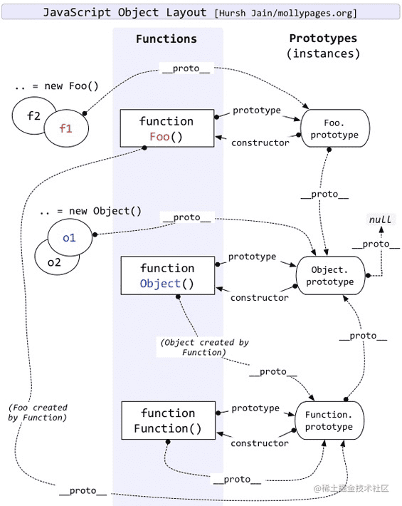

# 原型和原型链



## 普通对象和函数对象

所谓的函数对象，其实就是 JavaScript 用函数来模拟的类实现，JavaScript 中的 Object 和 Function 就是典型的函数对象。所有 Function 的实例都是函数对象，其余都是普通对象，包括 Function 的实例的实例。

```javascript
function fun1() {} // 函数对象
const fun2 = function () {}; // 函数对象
const fun3 = new Function('name', 'console.log(name)'); // 函数对象

const obj1 = {}; // 普通对象
const obj2 = new Object(); // 普通对象
const obj3 = new fun1(); // 普通对象
const obj4 = new new Function()(); // 普通对象
```

## `__proto__、constructor和prototype`

`__proto__`和`constructor`是对象特有的属性，`prototype`是函数特有的属性，由于函数也是一种对象，所以函数也有这两个属性。

### `__proto__`

`__proto__`是对象所独有的，并且`__proto__`是一个对象指向另一个对象，也就是他的原型对象。我们也可以理解为父类对象。它的作用就是当你在访问一个对象属性的时候，如果该对象内部不存在这个属性，那么就回去它的`__proto__`属性所指向的对象（父类对象）上查找，如果父类对象依旧不存在这个属性，那么就回去其父类的`__proto__`属性所指向的父类的父类上去查找。以此类推，知道找到 null。而这个查找的过程，也就构成了我们常说的原型链。

从浏览器的打印结果我们可以看出，上图对象 a 存在一个`__proto__`属性。而事实上，他只是开发者工具方便开发者查看原型的故意渲染出来的一个虚拟节点。虽然我们可以查看，但实则并不存在该对象上。
`__proto__`属性既不能被 for in 遍历出来，也不能被 Object.keys(obj) 查找出来。
访问对象的 `obj.__proto__` 属性，默认走的是 `Object.prototype` 对象上 `__proto__` 属性的 get/set 方法。

```javascript
Object.defineProperty(Object.prototype, '__proto__', {
  get() {
    console.log('get');
  },
});

console.log({}.__proto__); // get
console.log(new Object().__proto__); // get
```

### prototype

在规范里，`prototype` 被定义为：给其它对象提供共享属性的对象。`prototype` 自己也是对象，只是被用以承担某个职能罢了.

`prototype` 是对象特有的属性。它的作用就是包含可以给特定类型的所有实例提供共享的属性和方法。它的含义就是函数的运行对象，也就是这个函数所创建的实例的运行对象。任何函数在创建的时候，都会默认给该函数添加 `prototype` 属性。

### constructor

`constructor` 属性也是对象特有的属性，它是一个对象指向一个函数，这个函数就是该对象的构造函数。

每一个对象都有其对应的构造函数，本身或者继承而来。单从 `constructor` 这个属性来讲，只有 prototype 对象才有。每个函数在创建的时候，JavaScript 会同时创建一个该函数对应的 prototype 对象，而函数创建的对象.`__proto__` === 该函数.prototype，该函数.prototype.constructor===该函数本身，故通过函数创建的对象即使自己没有 `constructor` 属性，它也能通过`__proto__`找到对应的 `constructor`，所以任何对象最终都可以找到其对应的构造函数。

## typeof、instanceof

### typeof

typeof 可以判断 JavaScript 中变量的类型，可以判断`string`、`number`、`boolean`、`object`、`undefined`、`function`和`symbol`七种类型。但是使用 typeof 判断 object 类型时，不能准确告诉你该 object 的继承关系。

```javascript
typeof null === 'object';
```

由于 null 代表空指针，在大多数平台下的机器码为 0x00,因此 null 的类型标签是 0，而 JavaScript 在底层存储变量的时候，会在变量的机器码的低位 1-3 位存储其类型信息，`000`代表对象，所以 null 与对象的机器码一样，导致 typeof null === 'object'。

### instanceof

instanceof 和 typeof 非常的类似。instanceof 运算符用来检测 constructor.prototype 是否存在于参数 object 的原型链上。与 typeof 方法不同的是，instanceof 方法要求开发者明确地确认对象为某特定类型。

```javascript
// 定义构造函数
function C() {}
function D() {}

var c = new C();

c instanceof C; // true

c instanceof D; // false

c instanceof Object; // true

C.prototype instanceof Object; // true

C.prototype = {};

var c2 = new C();

c2 instanceof C; // true

c instanceof C; // false

D.prototype = new C();
var c3 = new D();

c3 instanceof D; // true
c3 instanceof C; // true
```

```javascript
Object instanceof Object; // true
Function instanceof Function; // true
Number instanceof Number; // false
String instanceof String; // false

Function instanceof Object; // true

Foo instanceof Function; // true
Foo instanceof Foo; // false
```

这里为什么 Object 和 Function instanceof 自己是 true，而 Foo instanceof 自己是 false，我们可以从 instanceof 的原理来剖析。

```javascript
function instance_of(left, right) {
  var right_proto = right.prototype;
  var left_proto = left.__proto__;

  while (true) {
    if (left_proto === null) {
      return false;
    }

    if (left_proto === right_proto) {
      return true;
    }

    left_proto = left_proto.__proto__;
  }
}
```

如上所示，instanceof 会比较左侧与右侧的变量，首先判断`left.__proto__`是否为 null，如果为 null，证明已经到头了；如果不为 null，则判断`left.__proto__`是否等于`right.prototype`，如果相等，则证明左侧是右侧的实例，否则，`left_proto = left_proto.__proto__`，继续向上查找。

```javascript
instance_of(Object, Object);
var right_proto = Object.prototype;
var left_proto = (Object.__proto__ = Function.prototype);

left_proto !== null;
left_proto !== right_proto;

left_proto = Function.prototype.__proto__ = Object.prototype;
left_proto !== null;
left_proto === right_proto;
```

```javascript
instance_of(Foo, Foo);
var right_proto = Foo.prototype;
var left_proto = (Foo.__proto__ = Function.prototype);

left_proto !== null;
left_proto !== right_proto;

left_proto = Function.prototype.__proto__ = Object.prototype;
left_proto !== null;
left_proto !== right_proto;

left_proto = Object.prototype.__proto__ = null;
```

所以如上所示，`Object instanceof Object` 为 true，`Foo instanceof Foo` 为 false。

## 继承

继承包括两类，一类为显式继承，一类为隐式继承。

### new 关键字

```javascript
function Person(name, sex) {
  this.name = name;
  this.sex = 'male';
}

Person.prototype.isHandsome = true;

Person.prototype.sayName = function () {
  console.log(`Hello , my name is ${this.name}`);
};

const person = new Person('BonBon', 'male');

console.log(person.name); // BonBon
console.log(person.sex); // male
console.log(person.isHandsome); // true

person.sayName(); // Hello , my name is BonBon
```

从上面的例子中可以看到，new 关键字得到的对象

- 可以访问构造函数的属性和方法
- 可以访问构造函数 prototype 上的属性和方法

#### 手写 new

```javascript
function object_factory() {
  //   首先创建一个空对象
  const obj = new Object();
  //   获取构造函数，即第一个参数
  const Constructor = [].shift.call(arguments);
  //   创建一个空函数
  const F = function () {};
  //   将构造函数的prototype指向新建的空函数
  F.prototype = Constructor.prototype;
  //   将obj设置为F的实例，这样obj就可以访问到构造函数原型的属性
  obj = new F();
  //   将构造函数指向obj，这样obj就可以访问到构造函数中的属性
  const result = Constructor.apply(obj, arguments);

  // 确保始终返回一个object
  return typeof result === 'object' ? result : obj;
}
```

### 类继承

```javascript
function SuperClass() {
  this.superName = 'super';
}

SuperClass.prototype.getSuperName = function () {
  return this.superName;
};

function SubClass() {
  this.subName = 'sub';
}

SubClass.prototype = new SuperClass();

SubClass.prototype.getSubName = function () {
  return this.subName;
};

const instance = new SubClass();

instance instanceof SuperClass; // true
instance instanceof SubClass; // true
SubClass instanceof SuperClass; // false
SubClass.instance instanceof SuerClass; // true
```

虽然实现起来清晰简洁，但是这种继承方式有两个缺点：

1. 由于子类通过其原型 `prototype` 对父类实例化，继承了父类，所以说父类中如果共有属性是引用类型，就会在子类中被所有的实例所共享，因此一个子类的实例更改子类原型从父类构造函数中继承的共有属性就会直接影响到其他的子类
2. 由于子类实现的继承是靠其原型 `prototype` 对父类进行实例化实现的，因此在创建父类的时候，是无法向父类传递参数的。因而在实例化父类的时候也无法对父类构造函数内的属性进行初始化

### 构造函数继承

```javascript
function SuperClass(id) {
  this.books = ['js', 'css'];
  this.id = id;
}
SuperClass.prototype.showBooks = function () {
  console.log(this.books);
};
function SubClass(id) {
  SuperClass.call(this, id);
}

const instance1 = new SubClass(10);
const instance2 = new SubClass(11);

instance1.books.push('html');
console.log(instance1);
console.log(instance2);
// TypeError
instance1.showBooks();
```

通过`SuperClass.call(this,id)`实现了继承，但是由于没有涉及原型，所以父类的 prototype 上的方法无法被继承。

### 组合式继承

```javascript
function SuperClass(name) {
  this.name = name;
  this.books = ['Js', 'CSS'];
}
SuperClass.prototype.getBooks = function () {
  console.log(this.books);
};
function SubClass(name, time) {
  SuperClass.call(this, name);
  this.time = time;
}
SubClass.prototype = new SuperClass();

SubClass.prototype.getTime = function () {
  console.log(this.time);
};
```

SubClass 的 prototype 指向 SuerClass 的实例，实现了父类的 prototype 上的方法的继承。

### 原型式继承

```javascript
function inheritObject(o) {
  // 声明一个过渡对象
  function F() {}
  // 过渡对象的原型继承父对象
  F.prototype = o;
  // 返回过渡对象的实例，该对象的原型继承了父对象
  return new F();
}
```

与类式继承类似，将父对象传入，通过过渡对象的原型继承父对象，最后返回过渡对象的实例。但是与类式继承一样，引用类型的变量也会存在子类实例共享的问题。

### 寄生式继承

```javascript
function inheritObject(o) {
  // 声明一个过渡对象
  function F() {}
  // 过渡对象的原型继承父对象
  F.prototype = o;
  // 返回过渡对象的实例，该对象的原型继承了父对象
  return new F();
}

function createBook(obj) {
  //通过原型方式创建新的对象
  const o = new inheritObject(obj);
  // 拓展新对象
  o.getName = function (name) {
    console.log(name);
  };
  // 返回拓展后的新对象
  return o;
}
```

在原型式继承的基础上，创建新的对象，并为新的对象添加新的属性和方法，最后返回该对象，既能继承父对象的属性和方法，又能拓展子对象的属性和方法。

### 寄生组合式继承

```javascript
function inheritObject(o) {
  //声明一个过渡对象
  function F() {}
  //过渡对象的原型继承父对象
  F.prototype = o;
  //返回过渡对象的实例，该对象的原型继承了父对象
  return new F();
}

function inheritPrototype(subClass, superClass) {
  // 复制一份父类的原型副本到变量中
  var p = inheritObject(superClass.prototype);
  // 修正因为重写子类的原型导致子类的constructor属性被修改
  p.constructor = subClass;
  // 设置子类原型
  subClass.prototype = p;
}
```
