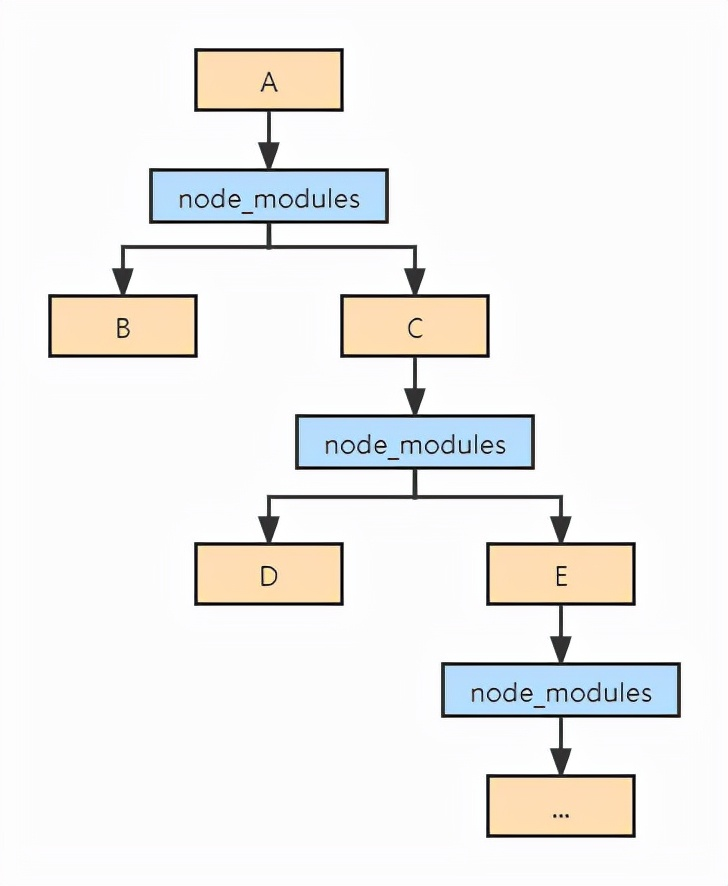
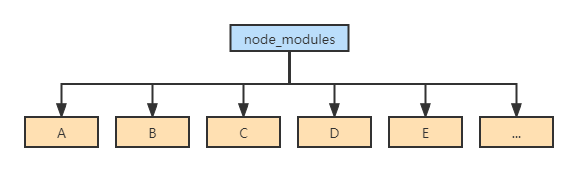
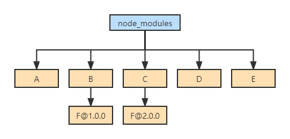
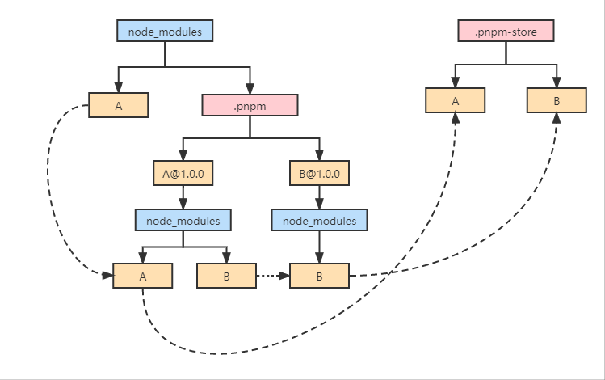
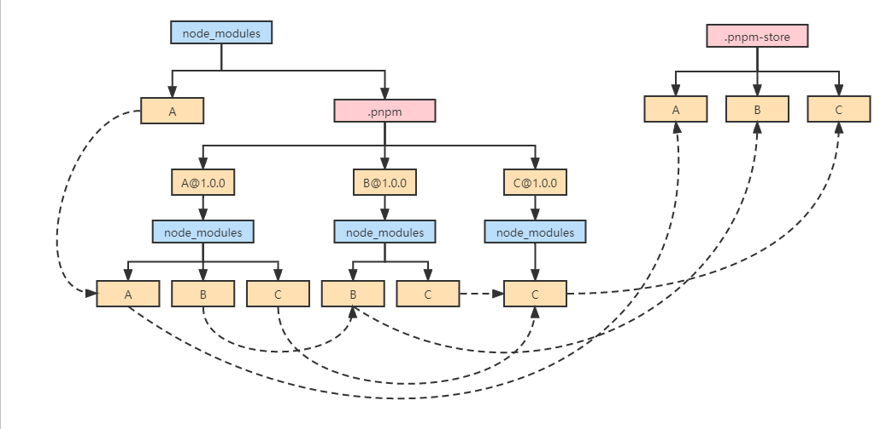

# npm、yarn 和 pnpm

前端程序员对 package.json 和 node_modules 应该都不陌生，但是很多人只知道通过`npm install`进行安装，通过`npm start`启动本地开发服务器，通过`npm run build`进行打包，但是对于 npm 是什么，npm 的作用是什么并不清楚。与此同时，对于很多 nodeJS 库，除了提供了 npm 的安装方式，也同样提供了 yarn、pnpm 等安装方式，那 yarn 和 pnpm 与 npm 相比区别是什么呢？

## npm 的作用是什么

npm 全称为 Node Package Manager，顾名思义，npm 是一种为 Node 提供的包管理器。Node 默认使用 npm。然而，npm 没有一些先进的功能，而这些功能对于更高级的应用程序来说是很理想的，或者说它在安装包或解决包的依赖性时速度很慢。yarn 和 pnpm 是社区制作的软件包管理器，它们的出现就是为了解决上述问题。在过去的几年里，yarn 变得越来越慢，但今天它可能是最受欢迎的选择。

## npm

npm 是一个 JavaScript 的包管理器，最初由 Node.js 项目开发。它使开发者能够更容易地在不同的项目中分享代码，并在自己的项目中使用其他人的代码。

## yarn

yarn 是一个 JavaScript 的包管理器，它是由 Facebook 开发的。它是快速、可靠和安全的。

## pnpm

pnpm 是一个新的 JavaScript 的包管理器，它建立在 npm 之上，以简化 node 应用程序中包的安装过程。pnpm 是 npm 的一个替代品。它遵循与 NPM 相同的原则，但它有一些额外的功能，使它比它的前辈更强大。

## 性能对比

### 1. 性能和磁盘效率

- npm v1 与 npm v2 使用了嵌套 node_modules 的方案，如下图 1 所示。

这会导致 3 个问题：

1、node_modules 体积过大(大量重复的包被安装)

2、node_modules 嵌套层级过深(会导致文件路径过长的问题)

3、模块实例不能共享

- yarn & npm v3

yarn 和 npm v3 使用了扁平化 node_modules 的方案，如下图 2 所示

扁平化处理时，比如安装 A，A 依赖 B 和 C，C 依赖 D 和 E，就把 A~E 全部放到 node_modules 目录下，从而解决上个版本中 node_modules 嵌套层级过深的问题。

在 install 安装时，会不停的往上级 node_modules 中寻找，如果找到同样的包，就不再重复安装，从而解决了大量包被重复安装的问题。

但是扁平化带来了新的问题：

1、依赖结构的不确定性

2、扁平化算法本身复杂性很高，耗时较长

3、项目中仍然可以非法访问没有声明过依赖的包

对于问题 1，比如 B 和 C 都依赖了 F，但是依赖的 F 版本不一样：

依赖结构的不确定性表现是扁平化的结果不确定，以下 2 种情况都有可能，取决于 package.json 中 B 和 C 的位置。

于是出现 yarn.lock(npm5 才有 package-lock.json)，来保证 install 后产生确定的依赖结构。但这并不能完全解决问题，node_modules 中依然存在各种不同版本的 F，而这可能导致各种情况的编译报错，以及安装满，占磁盘空间。

对于问题 3，package.json 中我们只声明了 A，B~F 都是因为扁平化处理才放到和 A 同级的 node_modules 下，理论上在项目中写代码时只可以使用 A，但实际上 B~F 也可以使用，由于扁平化将没有直接依赖的包提升到 node_modules 一级目录，Node.js 没有校验是否有直接依赖，所以项目中可以非法访问没有声明过依赖的包。

这会产生两个问题：

B~F 中的包升级后，项目可能出问题
额外的管理成本(比如协作时别人运行一次 npm install 后项目依旧跑不起来)

- pnpm

pnpm(Performance npm)的作者 Zoltan Kochan 发现 yarn 并没有打算去解决上述的这些问题，于是另起炉灶，写了全新的包管理器。

pnpm 复刻了 npm 所有的命令，所以使用方法和 npm 一样，并且在安装目录结构上做了优化，特点是善用链接，且由于链接的优势，大多数情况下 pnpm 的安装速度比 yarn 和 npm 更快。

1、安装依赖

A 和 B 一起放到.pnpm 中(和上面相比，这里没有耗时的扁平化算法)。

另外A@1.0.0下面是 node_modules，然后才是 A，这样做有两点好处：

允许包引用自身
把包和它的依赖摊平，避免循环结构
2、处理间接依赖

A 平级目录创建 B，B 指向B@1.0.0下面的 B。

3、处理直接依赖

顶层 node_modules 目录下创建 A，指向A@1.0.0下的 A。

对于更深的依赖，比如 A 和 B 都依赖了 C：

