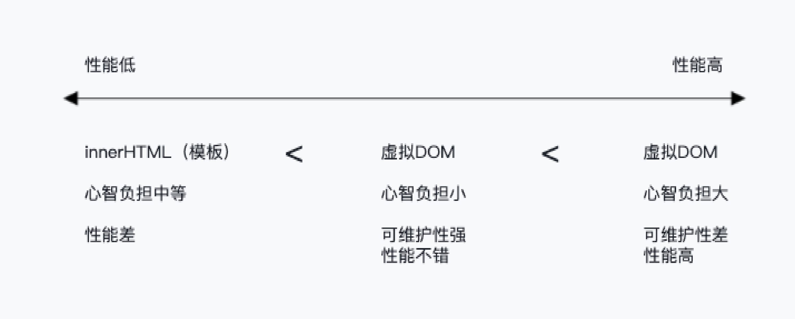

# 权衡的艺术

## 命令式和声明式

- 命令式

比如 jQuery，特点之一是关注过程

```javascript
$("#app") // 获取div
  .text("hello world") // 设置文本内容
  .on("click", () => {
    // 绑定点击事件
    alert("ok");
  });
```

- 声明式

比如 Vue，特点之一是关注结果

```vue
<div @click="() => alert('ok')">hello world</div>
```

## 性能与可维护性的权衡

**结论：声明式代码的性能不优于命令式代码的性能**

直接修改的性能消耗定义为 A，找出差异的性能消耗定义为 B

- 命令式代码的更新性能消耗为 A
- 声明式代码的更新性能消耗为 B + A

因此最理想的情况是，找出差异的性能消耗为 0 时，声明式代码与命令式代码的性能相同，但是无法做到超越。毕竟**框架本身就是封装了命令式代码才实现了面向用户的声明式**。

## 虚拟 DOM 的性能到底如何

由于**声明式代码的更新性能消耗 = 找出差异的性能消耗 + 直接修改的性能消耗**，所以如果我们能够最小化找出差异的性能消耗，就可以让声明式代码的性能无限接近命令式代码的性能。而所谓的虚拟 DOM，就是为了最小化找出差异这一步的性能消耗而出现的。

所以，采用虚拟 DOM 的更新技术的性能**理论上**不可能比原生 JavaScript 操作 DOM 更高。因为在大部分情况下，**我们很难写出绝对优化的命令式代码**。

虚拟 DOM 的存在就是为了保证让我们不用付出太多的努力（写声明式代码），还能够保证应用程序的性能下限，让应用程序的性能不至于太差，甚至想办法逼近命令式代码的性能。

### 创建页面时

|                    | 虚拟 DOM                      | innerHTML         |
| ------------------ | ----------------------------- | ----------------- |
| 纯 JavaScript 运算 | 创建 JavaScript 对象（VNode） | 渲染 HTML 字符串  |
| DOM 运算           | 新建所有 DOM 元素             | 新建所有 DOM 元素 |

虚拟 DOM 与使用 innerHTML 相比性能差距并不大。

### 更新页面时

|                    | 虚拟 DOM                        | innerHTML                            |
| ------------------ | ------------------------------- | ------------------------------------ |
| 纯 JavaScript 运算 | 创建新的 JavaScript 对象 + Diff | 渲染 HTML 字符串                     |
| DOM 运算           | 必要的 DOM 更新                 | 销毁所有旧 DOM <br>新建所有 DOM 元素 |

可以发现，相比于创建页面时，虚拟 DOM 多了一个 Diff 的性能消耗，Diff 是 JavaScript 层面的运算，不会产生数量级的差异，DOM 层面只需要更新必要的元素。所以当更新页面时，对于虚拟 DOM 来说，无论页面多大，都只会更新变化的内容；而对于 innerHTML 来说，页面越大，更新时的性能消耗越大。

|                    | 虚拟 DOM                        | innerHTML                            |
| ------------------ | ------------------------------- | ------------------------------------ |
| 纯 JavaScript 运算 | 创建新的 JavaScript 对象 + Diff | 渲染 HTML 字符串                     |
| DOM 运算           | 必要的 DOM 更新                 | 销毁所有旧 DOM <br>新建所有 DOM 元素 |
| 性能因素           | 与数据变化量相关                | 与模板大小相关                       |

基于此，我们可以粗略总结一下 innerHTML、虚拟 DOM 以及原生 JavaScript（指 createElement 等方法）在更新页面时的性能，如图 1-1 所示。


